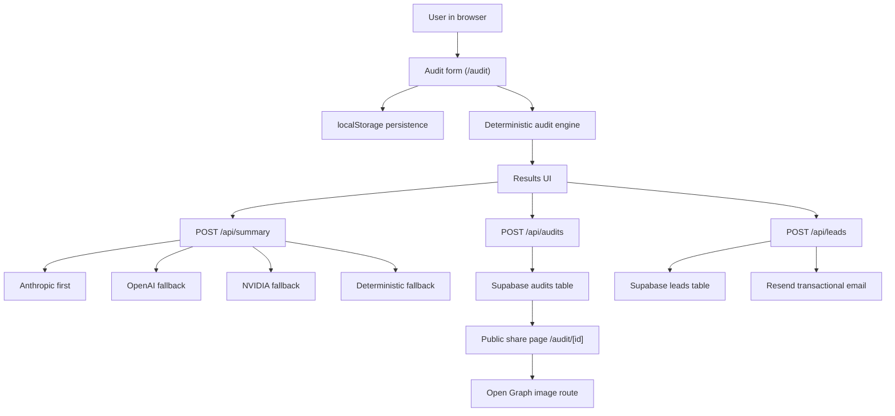

# Architecture

## System diagram

## Data flow

1. A user selects AI tools, plans, monthly spend, seats, team size, and a primary use case in the spend form.
2. The form persists in `localStorage`, so refreshes do not wipe the working state.
3. The client sends nothing to the server during normal editing; the deterministic audit engine runs locally in the app using typed pricing config and rule functions.
4. The engine produces per-tool recommendations, estimated monthly savings, annual savings, and an honest posture: either optimization-worthy or already healthy.
5. After the result is shown, the app optionally calls `/api/summary` to turn the deterministic result into a personalized summary paragraph. If Anthropic is unavailable, it falls back gracefully.
6. When the user wants to share the result, the app sends a de-identified audit snapshot to `/api/audits`, which stores a public record in Supabase and returns a UUID-backed share URL.
7. When the user enters an email after seeing value, `/api/leads` stores the lead in Supabase, applies honeypot plus IP-hash rate limiting, and triggers a transactional email through Resend when configured.

## Why this stack

- **Next.js App Router**: fast route composition, good Vercel deployment story, and clean server/client separation for an MVP.
- **TypeScript**: necessary here because the domain has structured pricing, typed plans, and recommendation objects that can drift if left loose.
- **Tailwind + shadcn/ui-style primitives**: fast to ship, consistent, and good for the Stripe/Vercel/Linear visual target without overbuilding a design system.
- **Supabase**: simple hosted Postgres with a gentle DX. It gives us real storage without dragging the project into backend ops too early.
- **Vitest**: quick unit coverage for the audit engine, which is the part evaluators will care about most.

## What belongs where

- `/app`: routes, layouts, Open Graph image route, and API handlers
- `/components`: reusable UI, landing sections, audit form, and result views
- `/config`: supported tools, plan pricing, env-backed AI config, and SQL bootstrap
- `/lib`: audit engine, rule engine, storage helpers, and Supabase wrappers
- `/tests`: deterministic audit engine tests
- `/types`: shared domain contracts for tools, inputs, public records, leads, and recommendations

## If this had to handle 10k audits/day

I would keep the same general architecture, but tighten the hot paths:

1. Move public audit creation and lead writes behind stricter database indexes and explicit retry-safe insert flows.
2. Add server-side caching for public audit pages and Open Graph image generation.
3. Put a real distributed rate limiter in front of `/api/leads` instead of only honeypot + IP hash.
4. Log summary-provider latency and failure rates, then queue AI summary generation asynchronously if provider tail latency becomes noticeable.
5. Add analytics on audit completion, lead capture, and public-share conversion so scaling decisions are tied to funnel value, not only raw traffic.

The main point is that the current MVP is intentionally simple, but it is simple in a way that has a believable growth path rather than being a one-off demo.
